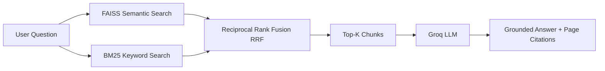

# ⚡ RAG Document Assistant

A modern, production-grade Streamlit application for conversational document Question-Answering using **Hybrid Retrieval (FAISS Semantic Vector Search + BM25 Lexical Keyword Search)** fused with **Reciprocal Rank Fusion (RRF)** and **Groq LLM** inference.

---

## 🌟 Key Features

- 🧠 **Dense Semantic Vector Search**: `sentence-transformers/all-MiniLM-L6-V2` embeddings stored and queried with FAISS CPU.
- 🔍 **Sparse Lexical Search**: BM25 Okapi for high-precision exact keyword, acronym, and code matching.
- ⚡ **Hybrid RRF Fusion**: Reciprocal Rank Fusion ($k=60$) combining semantic and keyword signals into optimal rankings.
- 🎯 **100% Grounded AI Generation**: Fast inference powered by Groq LLMs with strict zero-hallucination system prompt rules.
- 📚 **Verifiable Source Citations**: Collapsible citations under every response indicating the exact 1-indexed page number and extracted text chunk.
- 🔬 **Retrieval Flow Visualizer**: Interactive pipeline inspector displaying individual FAISS ranks, BM25 ranks, and fused RRF scores.
- ✨ **Enterprise Obsidian UI**: Dark-mode glassmorphic interface, interactive starter prompt chips, and real-time multi-step document indexing status.
- 💾 **Export Conversations**: One-click download of chat logs in Markdown (`.md`) and Text (`.txt`) formats.

---

## 🏗️ Architecture & Project Structure

```
RAGProject/
├── app.py                     # Main Streamlit UI & Application Orchestrator
├── ragpipeline.py             # Original CLI reference pipeline
├── main.py                    # Alternative CLI script
│
├── rag/                       # Modular RAG Pipeline Backend
│   ├── __init__.py            # Clean exports
│   ├── loader.py              # PDF loading & text splitting (RecursiveCharacterTextSplitter)
│   ├── embeddings.py          # Hugging Face embeddings with @st.cache_resource
│   ├── retriever.py           # FAISS, BM25Okapi, and HybridRetriever (RRF)
│   └── generator.py           # Groq LLM integration & prompt grounding
│
├── ui/                        # UI Components & Theme Styling
│   ├── __init__.py            # Clean UI exports
│   ├── styles.py              # Obsidian dark theme CSS & glassmorphism
│   └── components.py          # Header, hero, sidebar, citations & visualizer
│
├── data/
│   └── documents/             # Default document repository
│       └── Leave Policy 1.0.pdf
│
├── requirements.txt           # Python package dependencies
├── .env                       # API keys and environment variables
└── README.md                  # Setup & usage instructions
```

---

## 🚀 Quickstart Guide

### 1. Clone & Set Up Virtual Environment

```bash
# Navigate to project directory
cd RAGProject

# Create Python virtual environment
python -m venv venv

# Activate virtual environment
# Windows:
.\venv\Scripts\activate
# macOS/Linux:
# source venv/bin/activate
```

### 2. Install Dependencies

```bash
pip install -r requirements.txt
```

### 3. Configure API Keys (`.env`)

Create a `.env` file in the root folder with your Groq API key:

```env
GROQ_API_KEY=your_groq_api_key_here
HUGGINGFACE_API_TOKEN=your_huggingface_token_optional
```

> **Note**: Get your free Groq API key from [console.groq.com](https://console.groq.com).

### 4. Run the Streamlit Application

```bash
streamlit run app.py
```

Open your browser at `http://localhost:8501`.

---

## 💡 How It Works



1. **Upload**: Drag and drop any PDF into the upload area (or click the sample button for `Leave Policy 1.0.pdf`).
2. **Real-Time Indexing**: The app loads the PDF, splits it into chunks (`chunk_size=1000, chunk_overlap=150`), creates FAISS embeddings, and builds the BM25 index.
3. **Ask & Retrieve**: Ask questions via the chat input or click starter question chips.
4. **Inspect Sources**: Expand the citations below any AI message to verify the exact page and source text used to answer.
